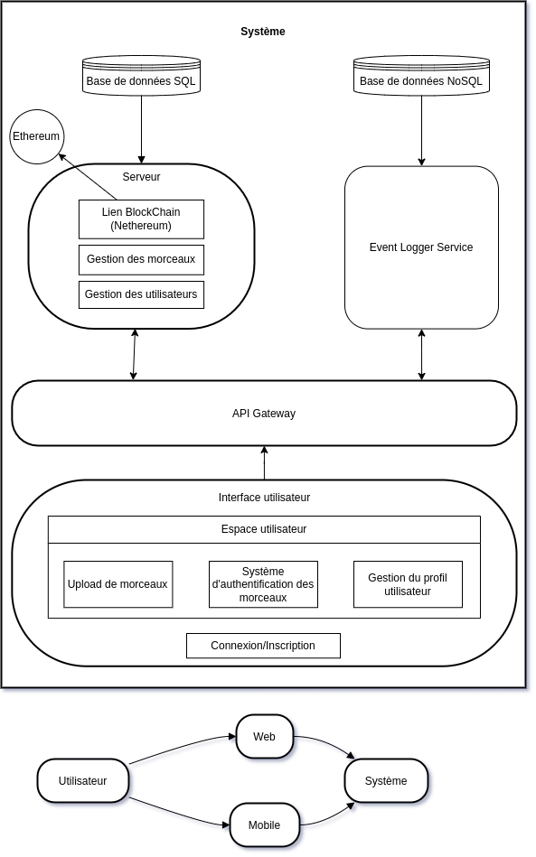

# LicenSync

## Summary

* [Prerequisites](#prerequisites)
    * [Required Software](#required-software)
* [Description](#description)
* [Stack](#stack)
* [Features](#features)
* [Quick Start (No Docker)](#quick-start-no-docker)
* [Environment Variables](#environment-variables)
* [Docker](#docker)
    * [Command for running the app](#command-for-running-the-app)
* [CI/CD](#cicd)
    * [Vulnerabilities and outdated content](#vulnerabilities-and-outdated-content)
        * [Vulnerabilities audit](#vulnerabilities-audit)
        * [Vulnerabilities fix](#vulnerabilities-fix)
        * [Deprecated content](#deprecated-content)
        * [Updating deprecated dependencies](#updating-deprecated-dependencies)
    * [Code quality](#code-quality)
        * [Linter](#linter)
* [Endpoints documentation](#endpoints-documentation)
    * [LICENSYNC API Endpoints summary](#licensync-api-endpoints-summary)
        * [Account Endpoints](#account-endpoints)
        * [Album Endpoints](#album-endpoints)
        * [API Endpoints](#api-endpoints)
        * [Artist Endpoints](#artist-endpoints)
        * [Blockchain Authentication Endpoints](#blockchain-authentication-endpoints)
        * [Contribution Endpoints](#contribution-endpoints)
        * [Genre Endpoints](#genre-endpoints)
        * [Health Endpoint](#health-endpoint)
        * [Track Endpoints](#track-endpoints)
* [User Authentication](#user-authentication)
    * [Registration](#registration)
    * [Login](#login)
* [Blockchain](#blockchain)
    * [Contract Deployment](#contract-deployment)
    * [Contract Interaction](#contract-interaction)
* [Database](#database)
* [Log Service](#log-service)
* [Troubleshooting](#troubleshooting)
* [System Architecture](#system-architecture)
* [License](#license)
* [Changelog](#changelog)

---

## Prerequisites

### Required Software
- **Docker** - Make sure Docker is installed on your machine.

- If Docker is not available, you'll need:
  - A **Linux** distribution to run FFMPEG.
  - **Node.js** 22 or above.
  - **Angular CLI**.
  - **.NET SDK 8**.
  - **.NET Runtime 8**.

---

## Description
**LicenSync** is a platform that enables artists to register their work on the blockchain, ensuring protection of their intellectual property. The platform consists of:
- A main backend (API) and its SQL Server database.
- A frontend (UI).
- Blockchain functionality for IP registration and verification.
- A logger service and its MongoDB database.
- An API Gateway for routing requests.
- Prometheus and Grafana for monitoring.

---

## Stack
- **API Database** : SQL Server
- **Logger Database** : MongoDB
- **Main Backend** : ASP.NET Core (.NET 8)
- **Logger Service** : NodeJS
- **API Gateway** : Nginx
- **Frontend** : Angular 18
- **Blockchain** : Hardhat with Solidity
- **Monitoring** : Prometheus and Grafana

---

## Features
- **User Registration** and **Login**
- **Track Upload** and Management:
    - Upload a track
    - View track details and list of tracks
    - Delete a track
- **Blockchain** Integration:
    - Register a track hash on the blockchain
    - Verify a track hash against the blockchain
- **User Profile** Management

---

## Quick Start (No Docker)

To set up the project manually (without Docker), follow these steps:

1. **Install Dependencies**:
    - Navigate to the frontend and backend directories and install dependencies:
      ```bash
      cd frontend && npm install
      cd backend && dotnet restore
      ```

2. **Environment Variables**:
    - Copy the provided `.env.example` file to the `.env` file, both located in the root directories and configure necessary environment variables.
      ```bash
      cp .env.example .env
      ```

3. **Run the Application**:
    - **Backend**: `dotnet run`
    - **Frontend**: `ng serve --open`

4. **Database Setup**:
    - Run migrations if needed to initialize the database.
      ```bash
      dotnet ef database update
      ```

This section can also help anyone to debug outside of Docker.

---

## Environment Variables

The application uses environment variables for configuration. Here are the required variables:

- **Backend**:
    - `CONNECTION_STRING`: Connection string for the SQL Server database.
    - `ASPNETCORE_ENVIRONMENT`: Environment for the backend.

- **Auth**:
    - `TOKEN_KEY`: Secret key for JWT authentication.
    - `TOKEN_ISSUER`: Issuer for JWT authentication.

- **Blockchain**:
  - `LICENSYNC_ABI`: ABI for the deployed contract.
  - `LICENSYNC_BYTECODE`: Bytecode for the deployed contract.
  - `DEPLOYER_ADDRESS`: Address of the contract deployer.
  - `BC_PRIVATE_KEY`: Private key for the contract owner.
  - `BC_INFURA_KEY`: Infura key for the blockchain network.
  - `LICENSYNC_CONTRACT_ADDRESS`: Address of the deployed contract.

- **Database**:
    - `PASSWORD`: Password for the SQL Server database.
  
- **Logger service**:
    - `MONGODB_URI`: Connection string for the MongoDB database.
    - `EVENT_LOGGER_SERVICE_PORT`: Port for the logger service.

Make sure to create a `.env` file with these values or set them in your deployment environment.
Make a `.env` file for development. 
The production environment variables have to be setup up in portainer, by hand or by uploading an environment file.

---

## Docker

### Command for running the app
- **Development Mode with Hot Reload**: 
```bash
cd app && docker compose watch
```
- **Stable Development Mode**: 
```bash
cd app && docker compose up
```
- **Shortcut for Stable Development Mode**: 
```bash
npm start:docker:dev
```
or
```bash
npm rebuild:docker:dev
```
- **Shutting Down the app**: 
```bash
docker compose down
```
- **Rebuilding Images**: Add 
```bash
--build
``` 
to the command, \
e.g. 
```bash
docker compose up --build
```

---

## CI/CD
The CI/CD pipeline includes :
- **Automated testing** : 
    - Vulnerabilities and code quality tests on pull request for backend and frontend when merging to develop, preprod and main.
    - Unit tests for backend and frontend in two GitHub action pipelines when merging to develop, preprod and main.
    - Cypress main feature test on push.
- **Automated deployment** :
    - Builds Docker images and pushes to Portainer on pushes to `preprod` and `main`.

### Vulnerabilities and outdated content

#### Vulnerabilities audit
To manually check for vulnerabilities :
- **Frontend and Hardhat** : 
```bash
npm audit
```
- **Backend** : 
```bash
dotnet list package --vulnerable
```

#### Vulnerabilities fix
To manually fix vulnerabilities :
- **Frontend and Hardhat** : 
```bash
npm audit fix
```
- **Backend** : 
```bash
dotnet add package <PACKAGE_NAME>
```

#### Deprecated content
To check for outdated dependencies :
- **Frontend and Hardhat** :
```bash
npm outdated
```
- **Backend** : 
```bash
dotnet list package --outdated
```

#### Updating deprecated dependencies
To update outdated dependencies :
- **Frontend and Hardhat** : 
```bash
npm update
``` 
or 
```bash
npm install <PACKAGE_NAME>@latest --save
```
- **Backend** : 
```bash
dotnet add package <PACKAGE_NAME>
```

### Code quality

#### Linter
To manually check code quality :
- **Frontend** : 
```bash
npx eslint .
```
- **Backend** : StyleCop is installed for linting and code style checks.

---

## Endpoints documentation
Access the API documentation via Swagger for a complete description of each endpoint :
- **Swagger URL** : ```{backendUrl}/swagger/index.html```

### LICENSYNC API Endpoints summary

#### Account Endpoints
- **POST** `/api/Account/register` - Register a new user
- **POST** `/api/Account/login` - Login to the system
- **POST** `/api/Account/logout` - Logout the current user
- **GET** `/api/Account/user-info` - Get user information
- **GET** `/api/Account/auth-status` - Check authentication status
- **POST** `/api/Account/user-details` - Update user details

#### Album Endpoints
- **POST** `/api/Album` - Create a new album
- **GET** `/api/Album` - Retrieve all albums
- **GET** `/api/Album/{id}` - Get album by ID
- **PUT** `/api/Album/{id}` - Update album by ID
- **DELETE** `/api/Album/{id}` - Delete album by ID
- **GET** `/api/Album/user/{userId}` - Get albums by user ID
- **GET** `/api/Album/album-card-list/{userId}` - Get album card list by user ID
- **GET** `/api/Album/album-card/{albumId}` - Get album card by album ID

#### API Endpoints
- **POST** `/api/register` - Register a new account
- **POST** `/api/login` - Login to the system
- **POST** `/api/refresh` - Refresh access token
- **GET** `/api/confirmEmail` - Confirm user email
- **POST** `/api/resendConfirmationEmail` - Resend confirmation email
- **POST** `/api/forgotPassword` - Request password reset
- **POST** `/api/resetPassword` - Reset password

#### Artist Endpoints
- **POST** `/api/Artist` - Create a new artist
- **GET** `/api/Artist` - Retrieve all artists
- **GET** `/api/Artist/{id}` - Get artist by ID
- **PUT** `/api/Artist/{id}` - Update artist by ID
- **DELETE** `/api/Artist/{id}` - Delete artist by ID
- **GET** `/api/Artist/track/{trackId}` - Get artists by track ID

#### Blockchain Authentication Endpoints
- **POST** `/api/BlockchainAuthentication/deploy-contract` - Deploy a blockchain contract
- **PUT** `/api/BlockchainAuthentication/store-hash/{trackId}` - Store hash on blockchain by track ID
- **GET** `/api/BlockchainAuthentication/compareHashes/{trackId}` - Compare track hashes on blockchain

#### Contribution Endpoints
- **POST** `/api/Contribution` - Create a new contribution
- **GET** `/api/Contribution` - Retrieve all contributions
- **GET** `/api/Contribution/{id}` - Get contribution by ID
- **PUT** `/api/Contribution/{id}` - Update contribution by ID
- **DELETE** `/api/Contribution/{id}` - Delete contribution by ID
- **GET** `/api/Contribution/artist/{artistId}` - Get contributions by artist ID

#### Genre Endpoints
- **POST** `/api/Genre` - Create a new genre
- **GET** `/api/Genre` - Retrieve all genres
- **GET** `/api/Genre/{id}` - Get genre by ID
- **PUT** `/api/Genre/{id}` - Update genre by ID
- **DELETE** `/api/Genre/{id}` - Delete genre by ID

#### Health Endpoint
- **GET** `/api/Health` - Check API health status

#### Logger Endpoints
- **GET** `/api/logger/events` - Retrieve all logs
- **GET** `/api/logger/{id}` - Get log by ID
- **DELETE** `/api/logger/{id}` - Delete log by ID
- **PUT** `/api/logger/type/{type}` - Get logs by type

#### Track Endpoints
- **POST** `/api/Track` - Create a new track
- **GET** `/api/Track` - Retrieve all tracks
- **POST** `/api/Track/track-card` - Create a new track card
- **GET** `/api/Track/{id}` - Get track by ID
- **PUT** `/api/Track/{id}` - Update track by ID
- **DELETE** `/api/Track/{id}` - Delete track by ID
- **GET** `/api/Track/user/{userId}` - Get tracks by user ID
- **GET** `/api/Track/picture/{id}` - Get track picture by ID
- **GET** `/api/Track/track-card-list/{userId}` - Get track card list by user ID
- **GET** `/api/Track/track-card/{trackId}` - Get track card by track ID


---

## User Authentication

### Registration
1. Go to `{baseUrl}/account/register`.
2. Fill out the form to register a new user.
3. After registration, you will be redirected to the login page.

### Login
1. Go to `{baseUrl}/account/login`.
2. Fill in your credentials to log in.
3. You will be redirected to the home page.

---

## Blockchain

### Contract Deployment
- **Manual Deployment** :  
```bash
cd hardhat && npx hardhat run scripts/deploy.js --network localhost
```
- **Automated Deployment** : Use the contract deployment endpoint in Swagger (`{backendUrl}/swagger/index.html`).

### Contract Interaction
- Interact with the contract via the contract interaction endpoints available in Swagger.

---

## Database
- The database is created automatically when the app is launched and the migrations are applied
- To access the database, use the database endpoints provided in the Swagger documentation.

## Log Service
- The log service is a separate service that logs events in a MongoDb database.
- To access the log service, two possibilities :
  - In dev mode : use the log service endpoints provided in the Swagger documentation.
  - In prod mode : use the logger service console provided in the Portainer interface and use Mongosh.

## Troubleshooting

### Common Issues

1. **Database Connection Issues**:
    - Ensure that the 
   ```dotenv
    DATABASE_CONNECTION_STRING
   ``` 
   is correctly configured and that the SQL Server instance is running.

2. **Docker Compose Errors**:
    - Run 
   ```bash
    docker-compose down --volumes
   ``` 
   to clear out any persistent volumes and try 
   ```bash
    docker-compose up --build
   ``` again.

3. **Blockchain Connection Issues**:
    - Verify that the 
    ```dotenv
    BLOCKCHAIN_PROVIDER_URL
    ``` 
   is reachable and that the network ID is correct.

4. **Cypress on push fails**:
    - If on watch mode with Docker, try running the containers with 
    ```bash
    docker compose up
    ```
   instead.

For additional help, consult the project’s issue tracker or contact the maintainers.

---

## System Architecture

Below is a simplified architecture diagram for LicenSync:



---

## License

This project is licensed under the MIT License - see the [LICENSE](LICENSE) file for details.

---

## Changelog

Refer to [CHANGELOG.md](./CHANGELOG.md) for a list of updates and version history.
